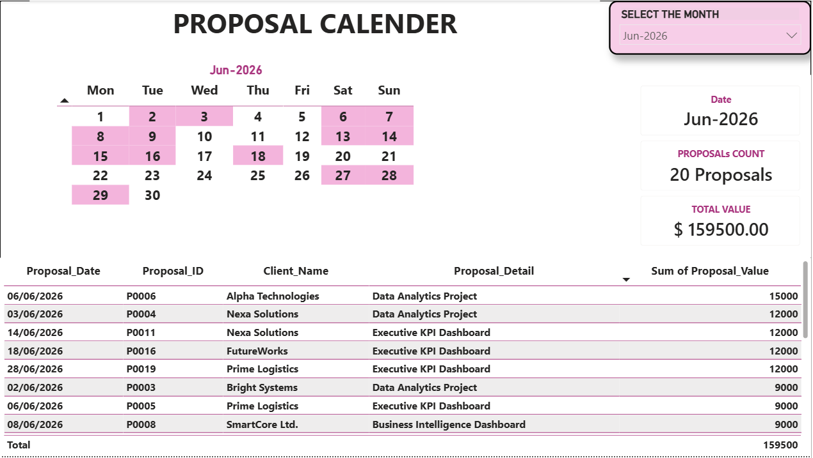

# 📅 Interactive Proposal Calendar | Power BI

An interactive **Power BI Proposal Calendar** designed to help users track proposal activity by date, identify days with submitted proposals, and explore proposal details through dynamic filtering and interactive tooltips.

The project simulates a real-world freelance/business use case where proposal records are connected to an interactive calendar that allows users to analyze proposal activity at both the monthly and daily levels.

---

## 🎯 Business Problem

Proposal data is often stored in a traditional table, making it difficult to quickly answer questions such as:

- Which days had proposals?
- How many proposals were submitted on a specific date?
- What was the total proposal value for a selected day?
- Which proposal records were created on a selected date?
- How does proposal activity change from month to month?

The objective of this project was to transform a simple proposal dataset into an **interactive calendar-based Power BI solution** that makes proposal activity easier to understand and explore.

---

## 💡 Solution

I developed an interactive Power BI calendar that:

- Highlights dates where one or more proposals were created.
- Keeps dates without proposals in their normal state.
- Allows users to select a specific month.
- Allows users to select an individual date.
- Automatically filters proposal details based on the selected date.
- Displays contextual proposal information through an interactive tooltip.
- Dynamically calculates proposal counts.
- Dynamically calculates total proposal value.
- Uses DAX measures for calendar logic and dynamic labels.
- Uses Power Query for data transformation and source configuration.
- Uses a parameterized data source to make the report reusable with different data locations.

---

# 📊 Key Features

## 📅 Interactive Proposal Calendar

The main feature of the project is an interactive calendar that displays the days of the selected month.

Dates containing one or more proposals are visually highlighted using conditional formatting.

Dates without proposals remain in their normal/default state.

This allows users to immediately identify proposal activity without manually searching through a transactional table.

---

## 🟦 Proposal Date Indicator

A DAX measure identifies whether proposals exist for the current calendar date.

The measure returns:

- `1` → Proposal exists
- `0` → No proposal exists

This indicator is used as part of the calendar's conditional formatting logic.

```DAX
PROPOSAL INDICATOR =
VAR P_COUNT = [PROPOSAL COUNT]
RETURN
IF(
    P_COUNT > 0,
    1,
    0
)
```

---

## 🗓️ Month-Year Filtering

A Month-Year selector allows users to navigate between different proposal months.

When a month is selected:

- The calendar updates.
- Highlighted proposal dates update.
- Proposal details update.
- Proposal counts update.
- Total proposal values update.
- The dynamic title updates.

---

## 🔎 Date Selection

Users can click a specific calendar date.

For example:

**18 Jun 2026**

The report automatically filters the proposal details to records created on that date.

This provides an intuitive way to move from:

**Calendar → Date → Proposal Details**

---

## 💬 Interactive Tooltip

Hovering over a calendar date displays contextual information about proposal activity.

The tooltip includes:

- Selected Date
- Proposal Count
- Total Proposal Value

Example:

> **26 Jul 2026**
> 1 Proposal
> $9,000

For dates without proposals:

> **No Proposals**

This provides additional information without overcrowding the main dashboard.

---

## 🧮 DAX Measures

The project uses DAX measures to create dynamic calculations, calendar indicators, interactive labels, and user-friendly date displays.

### Proposal Count

Counts proposal records within the current filter context.

```DAX
PROPOSAL COUNT =
COUNTROWS(FACT_PROPOSALS)
```

### Proposal Indicator

Used to identify dates containing one or more proposals.

The measure returns 1 when proposals exist for the current date and 0 otherwise.

It is used to support the calendar's conditional formatting logic.

```DAX
PROPOSAL INDICATOR =
VAR P_COUNT = [PROPOSAL COUNT]
RETURN
IF(
    P_COUNT > 0,
    1,
    0
)
```

### Proposal Count Label

Creates a user-friendly proposal count label for the interactive tooltip.

It handles zero, singular, and plural cases.

```DAX
PROPOSAL COUNT LABEL =
VAR C = [PROPOSAL COUNT]
RETURN
IF(
    C = 0,
    "No Proposals",
    C & IF(
        C = 1,
        " Proposal",
        " Proposals"
    )
)
```

Examples:

| Proposal Count | Display |
|---|---|
| 0 | No Proposals |
| 1 | 1 Proposal |
| 2 | 2 Proposals |

### Selected Date

Returns the currently selected calendar date in a user-friendly format.

```DAX
SELECTED DATE =
VAR D = SELECTEDVALUE(DIM_DATE[Date])
RETURN
IF(
    ISBLANK(D),
    BLANK(),
    FORMAT(D, "dd MMM yyyy")
)
```

Example output:

**18 Jun 2026**

### Dynamic Title

Creates a dynamic title based on the selected month.

```DAX
DYNAMIC TITLE =
VAR VAL = SELECTEDVALUE(DIM_DATE[MONTH-YEAR])
RETURN
IF(
    ISBLANK(VAL),
    "PROPOSAL CALENDAR",
    VAL
)
```

The title automatically updates when the user changes the selected month.

---

## 🏗️ Data Model

The project uses a simple analytical model consisting of a dedicated Date dimension and a proposal fact table.

```
                DIM_DATE
                   │
                   │ 1 : *
                   ▼
            FACT_PROPOSALS
```

### FACT_PROPOSALS

The FACT_PROPOSALS table contains proposal-level transactional data.

Main fields include:

- Proposal_ID
- Proposal_Date
- Client_Name
- Proposal_Detail
- Proposal_Value

### DIM_DATE

A dedicated Date dimension is used for:

- Date filtering
- Month-Year filtering
- Calendar construction
- Weekday analysis
- Time-based calculations

Example fields include:

- Date
- Year
- Month
- Month-Year
- Month Name
- Week Number
- Day Name
- Day Number

---

## 🔄 Power Query

Power Query is used for data ingestion, transformation, and source configuration.

The project uses a parameterized data source instead of hard-coding the complete Excel file path directly into the query.

### Data Folder Parameter

The project uses the following Power Query parameter:

**pDataFolder**

The parameter stores the location of the folder containing the proposal dataset.

The Excel source is dynamically constructed using:

```
pDataFolder & "\Interactive_Proposal_Calendar_Dataset.xlsx"
```

This allows the same Power BI report to be reused when the data file is stored in a different folder.

---

## 🔧 Client Data Replacement

The report is designed to support replacement of the underlying proposal data.

If the client provides a new Excel file with the same expected structure, the dashboard logic does not need to be rebuilt.

### First-Time Setup

1. Place the client Excel file inside the desired data folder.
2. Open the Power BI report.
3. Go to Transform Data → Manage Parameters.
4. Select pDataFolder.
5. Update the parameter with the client's data folder path.
6. Apply the changes.
7. Refresh the Power BI report.

After the initial configuration, future data updates only require refreshing the report.

**Important:** Because the current implementation uses a local Excel file, the client must configure the pDataFolder parameter once when the report is moved to a different computer or folder.

---

## 🔄 Handling Different Column Names

The report can also be adapted when a client's dataset contains the same business information but uses different column names.

Power Query can be used to map the client's fields to the expected model fields.

### Example

| Client Column | Model Column |
|---|---|
| Proposal No | Proposal_ID |
| Submission Date | Proposal_Date |
| Company | Client_Name |
| Description | Proposal_Detail |
| Amount | Proposal_Value |

This transformation allows the existing DAX measures and dashboard logic to remain unchanged when the underlying business fields are equivalent.

If the client's dataset is missing required business fields or has a significantly different structure, additional transformation or report modifications may be required.

---

## 📐 Project Architecture

```
Excel Proposal Data
        │
        ▼
   pDataFolder
        │
        ▼
   Power Query
        │
        ▼
 FACT_PROPOSALS
        │
        │ 1 : *
        ▼
    DIM_DATE
        │
        ▼
    DAX Measures
        │
        ▼
 Interactive Calendar
        │
        ├── Month-Year Filter
        ├── Proposal Date Selection
        ├── Conditional Formatting
        ├── Interactive Tooltip
        └── Proposal Details Table
```

---

## 🎨 Dashboard Design

The dashboard was designed with a clean and minimal interface focused on usability and interactive exploration.

### Main Components

- 📅 Proposal Calendar
- 🗓️ Month-Year Selector
- 🔎 Date Selection
- 💬 Interactive Tooltip
- 📋 Proposal Details Table
- 📊 Proposal Count
- 💰 Total Proposal Value
- 🔄 Dynamic Title

The design focuses on providing useful information without overcrowding the dashboard.

---

## 🔁 User Interaction Flow

The report is designed around a simple user workflow:

```
Select Month
     ↓
View Proposal Activity
     ↓
Identify Highlighted Dates
     ↓
Hover Over Date
     ↓
View Tooltip
     ↓
Click Date
     ↓
Filter Proposal Details
```

This creates an intuitive navigation experience from high-level calendar activity to detailed proposal records.

---

## 🚀 Use Cases

The solution can be adapted to many date-based business scenarios, including:

- Freelance proposal tracking
- Sales activity tracking
- Lead submission tracking
- Job application tracking
- CRM activity monitoring
- Task tracking
- Appointment tracking
- Marketing campaign activity
- Recruitment activity
- Any date-based transactional dataset

---

## 🛠️ Tools & Technologies

| Category | Tools |
|---|---|
| Business Intelligence | Microsoft Power BI |
| Data Transformation | Power Query, M Language |
| Analytics | DAX |
| Data Modeling | Date Dimensions |
| Data Source | Microsoft Excel |
| Visualization | Interactive Calendar, Conditional Formatting, Tooltips, Cross-filtering, Dynamic Titles, Interactive Tables |

---

## 📊 Technical Skills Demonstrated

This project demonstrates practical experience with:

- Power BI dashboard development
- DAX measure development
- Power Query transformations
- Data modeling
- Date table creation
- Conditional formatting
- Interactive visual design
- Cross-filtering
- Dynamic titles
- Tooltip design
- Parameterized data sources
- Data mapping
- User-focused dashboard development

---

## 📌 Key Learning Outcomes

Through this project, I practiced how to:

- Translate a real business requirement into a Power BI solution.
- Build a custom interactive calendar experience.
- Create a dedicated Date dimension.
- Build DAX measures for dynamic calendar behavior.
- Use conditional formatting to highlight dates.
- Build interactive tooltips.
- Create dynamic titles.
- Implement cross-filtering between visuals.
- Use Power Query parameters for reusable data sources.
- Design a solution that can be adapted to client data.
- Handle differences in source column names through Power Query.
- Think about Power BI deployment and client handover requirements.

---

## 📁 Project Structure

```
Interactive_Proposal_Calendar/
│
├── Interactive_Proposal_Calendar.pbix
│
├── Data/
│   └── Interactive_Proposal_Calendar_Dataset.xlsx
│
├── images/
│   └── proposal-calendar-dashboard.png
│
└── README.md
```

---

## 📸 Dashboard Preview

Add the final dashboard screenshot to the images folder.


---


---

## 💼 Real-World Client Scenario

This project was inspired by a real-world Power BI requirement:

> Proposal data contains a Proposal Created Date, and the user needs an interactive calendar where dates containing proposals are highlighted. Selecting a highlighted date should automatically filter a proposal details section below the calendar.

The solution was designed to address this requirement using:

- Power BI
- DAX
- Power Query
- Date modeling
- Conditional formatting
- Interactive filtering
- Custom tooltip design

The project demonstrates how a business requirement can be translated into a reusable Power BI solution.

---

## 🔐 Data

The dataset used in this project is synthetic and created for portfolio and educational purposes.

No confidential client data is included.

---

## 👨‍💻 Author

**Mohamed Swidan**

Data / BI Analyst

### Core Skills

- Power BI
- DAX
- Power Query
- SQL
- Python
- Excel
- Tableau
- Data Visualization
- Data Analysis

---

## ⭐ Project Objective

The objective of this project was to transform a simple proposal dataset into an interactive analytical experience that allows users to understand proposal activity quickly and intuitively.

The project focuses not only on visualization, but also on:

- Data modeling
- Data transformation
- DAX
- Conditional formatting
- User interaction
- Tooltip design
- Reusable Power BI architecture
- Client data replacement
- Practical Power BI deployment considerations

The final solution demonstrates how Power BI can turn transactional proposal data into a clean, interactive, and user-friendly business tool.
